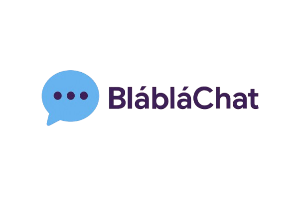
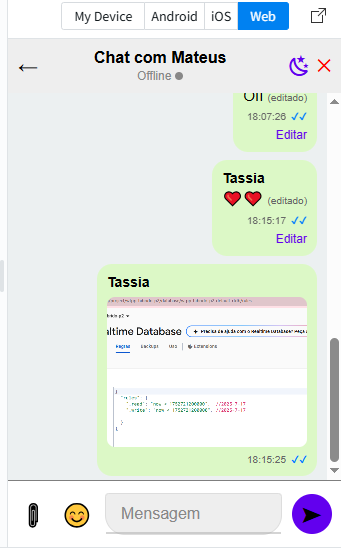
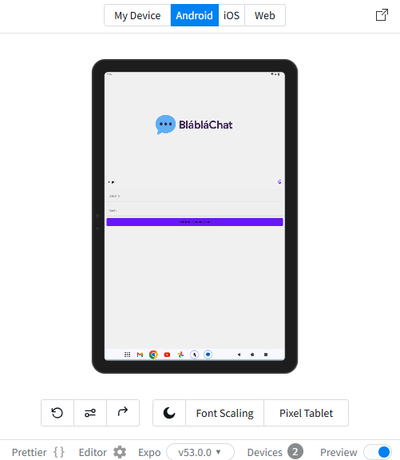

# 🚀 BlaBlaChat: Um Aplicativo de Mensagens Híbrido com React Native e Firebase
 

_Um aplicativo de mensagens moderno e interativo, desenvolvido para o trabalho final da disciplina de Laboratório de Desenvolvimento de Aplicativos Híbridos._

Bem-vindo ao **BlaBlaChat**! Este projeto é a culminação de um trabalho de desenvolvimento de aplicativo de mensagens, construído com **React Native** para o frontend e **Firebase Realtime Database** para um backend em tempo real. O desenvolvimento inicial e a prototipagem foram realizados utilizando a plataforma **Expo Snack**, facilitando a colaboração e o teste rápido.

Nosso objetivo foi aprimorar um sistema existente, introduzindo funcionalidades avançadas de comunicação e demonstrando proficiência em desenvolvimento híbrido.

---

## 📚 Sumário

* [👥 Equipe de Desenvolvimento](#equipe-de-desenvolvimento)
* [🎯 Objetivos Gerais do Projeto](#objetivos-gerais-do-projeto)
* [🛠️ Base do Projeto e Tecnologias](#base-do-projeto-e-tecnologias)
* [✨ Funcionalidades Implementadas](#funcionalidades-implementadas)
    * [Funcionalidades Obrigatórias](#funcionalidades-obrigatorias)
    * [🌟 Componente Criativo (Diferencial Obrigatório)](#componente-criativo-diferencial-obrigatorio)
* [📸 Galeria de Telas](#galeria-de-telas)
* [🚀 Como Rodar o Projeto](#como-rodar-o-projeto)
* [📂 Estrutura do Projeto](#estrutura-do-projeto)

---

## 👥 Equipe de Desenvolvimento

| Nome Completo             | Matrícula  |
| :------------------------ | :--------- |
| Tássia Mª Mendonça do Nascimento | 202212166  |
| Mateus Barreto das Chagas | 202212170  |
| Tamyres Lopes de Faria Silva | 202211177  |

**Instituição:** Universidade de Vassouras - Campus Maricá  
**Matéria:** Laboratório de Desenvolvimento de Aplicativos Híbridos  
**Trabalho:** Evolução de Aplicativo de Mensagens com React Native e Firebase

---

## 🎯 Objetivos Gerais do Projeto

Durante o desenvolvimento do BlaBlaChat, focamos em atingir os seguintes objetivos, que foram integralmente cumpridos:

1.  **Aprofundar Conhecimento Prático:** Consolidar a experiência em desenvolvimento de aplicativos híbridos com React Native, explorando suas capacidades e ecossistema.
2.  **Dominar Firebase Realtime Database:** Adquirir proficiência na integração e utilização do Firebase Realtime Database, enfatizando persistência e sincronização de dados em tempo real para uma experiência de chat fluida.
3.  **Exercitar Análise, Design e Implementação:** Aprimorar a capacidade de analisar requisitos, projetar soluções e implementar novas funcionalidades em um sistema de mensagens já existente.
4.  **Promover Trabalho em Equipe:** Fortalecer a colaboração, divisão de tarefas e gestão de um mini-projeto de software em um ambiente de equipe.
5.  **Estimular Criatividade e Inovação:** Incentivar a idealização e implementação de funcionalidades únicas que diferenciam nosso aplicativo.

---

## 🛠️ Base do Projeto e Tecnologias

Este projeto foi construído sobre uma base sólida, utilizando tecnologias modernas para garantir um aplicativo robusto e dinâmico:

* **Repositório Base:** [loyoladesa/AplicativosHibridos2025/tree/whatsapp-firebase](https://github.com/loyoladesa/AplicativosHibridos2025/tree/whatsapp-firebase)
* **Frontend:** Desenvolvido com **React Native**, utilizando **Expo** para agilizar o desenvolvimento e teste.
* **Backend/Banco de Dados:** **Firebase**, com foco total no **Realtime Database** para gerenciar e sincronizar dados em tempo real, crucial para a funcionalidade de chat.
* **Estrutura do Banco:** A estrutura do banco de dados (conforme `banco.json` e adaptada no Firebase) foi cuidadosamente planejada para suportar todas as funcionalidades implementadas, incluindo coleções para `login`, `users`, `chats`, `messages` e `usersStatus`.

---

## ✨ Funcionalidades Implementadas

A partir da base do projeto, o BlaBlaChat evoluiu para incluir as seguintes funcionalidades obrigatórias e diferenciais, proporcionando uma experiência de usuário rica e intuitiva. **Todos os pontos abaixo foram atendidos com sucesso!**

### Funcionalidades Obrigatórias

1.  **Conversas Particulares (Mensagens com Destinatário Específico)**
    * **Implementação:** A lógica foi cuidadosamente modificada para permitir que os usuários iniciem e troquem mensagens em conversas individuais. Ao selecionar um contato na `ContactsScreen`, o aplicativo gera um `chatId` único e consistente (baseado na ordem alfabética dos nomes dos participantes). Este `chatId` é crucial para gerenciar e exibir mensagens específicas daquela conversa no `Mensagens.js`, garantindo que a comunicação seja direcionada corretamente.
    * **Valorização:** Essencial para a privacidade e organização, essa funcionalidade permite uma experiência de chat autêntica, onde cada conversa é isolada e sincronizada em tempo real via Firebase.

2.  **Destaque Visual para Mensagens Próprias**
    * **Implementação:** Para uma interface intuitiva, as mensagens enviadas pelo usuário logado são visivelmente distintas. Elas são alinhadas à direita da tela e possuem uma cor de fundo específica (`myMessageBackground`), contrastando com as mensagens recebidas, que são alinhadas à esquerda e usam outra cor de fundo (`otherMessageBackground`). Essa distinção é controlada dinamicamente no `Mensagens.js` com base no remetente da mensagem e no tema ativo.
    * **Valorização:** Aprimora significativamente a legibilidade e a usabilidade do chat, permitindo ao usuário identificar rapidamente suas próprias contribuições na conversa.

3.  **Envio de Arquivos (Imagens e Documentos)**
    * **Implementação:** O BlaBlaChat permite o compartilhamento de arquivos diretamente na conversa. Utilizamos `expo-image-picker` e `expo-document-picker` para a seleção de mídias e documentos do dispositivo. Os arquivos são eficientemente convertidos para o formato Base64 para armazenamento no Firebase Realtime Database. Na interface, imagens são exibidas como miniaturas clicáveis (abrindo um modal de visualização em tela cheia), e documentos (como PDFs) aparecem como um link com um ícone de arquivo, permitindo que o usuário os abra em visualizadores externos.
    * **Valorização:** Expande a capacidade de comunicação para além do texto, facilitando o compartilhamento de informações ricas e integrando-se perfeitamente às funcionalidades nativas do dispositivo.

4.  **Confirmação de Visualização de Mensagem**
    * **Implementação:** Foi integrado um sistema de "tick" para indicar o status da mensagem. Uma marca de seleção única (✔) aparece para mensagens enviadas. Quando a mensagem é visualizada pelo destinatário, a marca de seleção se transforma em **dois ticks azuis (✔✔)**. O status é atualizado em tempo real: um pequeno update no Firebase é disparado ao ser lida, e o remetente vê a confirmação visual instantaneamente.
    * **Valorização:** Oferece um feedback crucial, claro e visualmente intuitivo ao remetente sobre a entrega e leitura de suas mensagens, aumentando a confiabilidade, a transparência e a usabilidade da comunicação.

5.  **Exibição da Hora de Envio da Mensagem**
    * **Implementação:** Cada balão de mensagem exibe o horário exato em que a mensagem foi enviada. O `timestamp` armazenado no Firebase é formatado e exibido de forma discreta no rodapé de cada mensagem no `Mensagens.js`.
    * **Valorização:** Proporciona um contexto temporal essencial para as conversas, permitindo um acompanhamento claro e preciso do fluxo da comunicação.

6.  **Criação e Integração de Logotipo para a Aplicação**
    * **Implementação:** Um logotipo original e cativante para o BlaBlaChat foi desenvolvido e integrado nas telas de Login e Contatos (`App.js`), garantindo uma identidade visual coesa e profissional ao aplicativo.
    * **Valorização:** Reforça a marca do aplicativo, tornando-o mais memorável e visualmente atraente para o usuário.

7.  **Edição de Mensagem Enviada**
    * **Implementação:** O usuário possui a capacidade de editar o conteúdo de mensagens de texto que ele já enviou. Ao interagir com sua própria mensagem, uma opção de edição aparece. Após a edição e o reenvio, o conteúdo é atualizado no Firebase, e a mensagem exibe um pequeno indicador "(editado)", mantendo a transparência na conversa.
    * **Valorização:** Uma funcionalidade avançada que confere maior controle ao usuário sobre suas comunicações, possibilitando correções rápidas e melhorando a qualidade geral das mensagens.

### 🌟 Componente Criativo (Diferencial Obrigatório)

Nossa equipe foi além das funcionalidades essenciais, incorporando elementos inovadores que tornam o BlaBlaChat mais expressivo, acessível e engajador:

* **Reações a Mensagens (Emojis)**
    * **Implementação:** Integramos um seletor de emojis na caixa de entrada de mensagens. Um modal intuitivo com uma grade de emojis populares permite que o usuário adicione rapidamente expressividade às suas mensagens de texto, sem a necessidade de teclado de terceiros.
    * **Inovação:** Enriquece a comunicação não-verbal, permitindo que os usuários transmitam emoções e reações de forma rápida e divertida.

* **Temas Personalizáveis (Modo Claro/Escuro)**
    * **Implementação:** O BlaBlaChat oferece uma experiência visual flexível com a opção de alternar entre um tema claro e um tema escuro completo. As paletas de cores são definidas centralizadamente (`LightTheme`, `DarkThemeCustom` em `App.js`) utilizando o sistema de theming do `react-native-paper`. Um botão de alternância (com ícones de sol/lua via `MaterialCommunityIcons`) está disponível nas telas principais, permitindo a personalização instantânea do visual do aplicativo.
    * **Inovação:** Aumenta a acessibilidade do aplicativo em diferentes condições de iluminação e oferece uma personalização estética valorizada pelos usuários modernos.

* **Status Online/Offline do Contato em Tempo Real**
    * **Implementação:** Na tela de chat, exibimos o status "Online" ou "Offline" do contato em tempo real, acompanhado de um indicador visual (círculo verde para online, cinza para offline) ao lado do nome do usuário. Isso é alcançado monitorando a coleção `usersStatus` no Firebase, que é atualizada automaticamente quando os usuários se conectam ou desconectam.
    * **Inovação:** Proporciona um senso de presença e imediatismo à conversa, informando o usuário sobre a disponibilidade de seu contato e tornando a interação mais dinâmica e engajadora.

---

## 📸 Galeria de Telas

Aqui estão algumas capturas de tela do BlaBlaChat em ação, demonstrando as funcionalidades e a interface em diferentes modos:

### Tela de Chat (Modo Claro)


### Tela de Chat (Modo Escuro)


### Tela de Login (Android - Modo Claro)


---

## 🚀 Como Rodar o Projeto

Este projeto foi desenvolvido e prototipado principalmente na plataforma **Expo Snack** (`https://snack.expo.dev/`), o que facilitou o desenvolvimento rápido e os testes iniciais. Para testar o BlaBlaChat em seu ambiente de desenvolvimento local, siga os passos abaixo:

1.  **Clone o Repositório:**
    ```bash
    git clone https://github.com/loyoladesa/AplicativosHibridos2025.git
    cd AplicativosHibridos2025/whatsapp-firebase
    ```
2.  **Instale as Dependências:**
    ```bash
    npm install # ou yarn install
    ```
3.  **Configurações do Firebase:**
    * Crie um projeto no [Firebase Console](https://console.firebase.google.com/).
    * Crie um **Realtime Database** para o projeto.
    * Vá para "Configurações do projeto" (ícone de engrenagem) > "Seus aplicativos" > "Adicionar aplicativo" (selecione a opção **Web** `</>`). Copie as credenciais de configuração.
    * Crie ou atualize o arquivo `config/Firebase.js` com suas credenciais:
        ```javascript
        import firebase from 'firebase/app';
        import 'firebase/database';

        const firebaseConfig = {
          apiKey: "SEU_API_KEY",
          authDomain: "SEU_AUTH_DOMAIN",
          databaseURL: "SEU_DATABASE_URL",
          projectId: "SEU_PROJECT_ID",
          storageBucket: "SEU_STORAGE_BUCKET",
          messagingSenderId: "SEU_MESSAGING_SENDER_ID",
          appId: "SEU_APP_ID"
        };

        // Inicializa o Firebase se ainda não foi inicializado
        if (!firebase.apps.length) {
          firebase.initializeApp(firebaseConfig);
        }

        export const database = firebase.database();
        ```
    * **Configure as Regras do Realtime Database (para desenvolvimento):**
        No Firebase Console, vá em "Realtime Database" > aba "Regras". Para facilitar o desenvolvimento, defina:
        ```json
        {
          "rules": {
            ".read": "true",
            ".write": "true"
          }
        }
        ```
        ⚠️ **ATENÇÃO:** Essas regras **não são seguras para produção**! Para um aplicativo real, implemente regras de segurança mais robustas e utilize o Firebase Authentication.
    * **Opcional: Estrutura Inicial do Banco (`banco.json`):** Para popular o banco com dados de exemplo (usuários, chats), você pode importar o conteúdo do `banco.json` fornecido para o seu Realtime Database (aba "Dados" > menu de três pontos > "Importar JSON").

4.  **Execute o Aplicativo:**
    ```bash
    npm start # ou expo start
    ```
    * Isso abrirá uma janela do navegador com o Expo Dev Tools.
    * **Recomendado:** Escaneie o QR Code com o aplicativo **Expo Go** no seu smartphone (Android/iOS) para uma experiência mais fiel e para testar a integração com o Firebase de forma mais confiável.
    * Você também pode optar por rodar em um simulador/emulador conectado.

---

## 📂 Estrutura do Projeto

```text
whatsapp-firebase/
├── assets/                  # Contém o logotipo da aplicação e outros recursos visuais (ícones, splash screens).
│   ├── blablachat.png       # Logotipo principal do app.
│   ├── icon.png
│   ├── splash-icon.png
│   └── screenshots/         # Capturas de tela do aplicativo para documentação.
│       ├── Screenshot_183.png
│       ├── Screenshot_184.png
│       └── Screenshot_185.png
├── components/              # Contém os principais componentes React que compõem as telas do aplicativo.
│   ├── ContactsScreen.js    # Tela para listar usuários e iniciar novas conversas.
│   ├── Login.js             # Tela de autenticação de usuários (login e cadastro).
│   └── Mensagens.js         # Tela principal de chat, onde as mensagens são exibidas e enviadas.
├── config/                  # Contém arquivos de configuração globais.
│   └── Firebase.js          # Configurações de inicialização do SDK do Firebase.
├── App.js                   # Componente raiz da aplicação, gerencia o estado global (navegação, temas) e renderiza as telas principais.
├── app.json                 # Arquivo de configuração do Expo para o aplicativo (nome, ícone, splash screen, etc.).
├── package.json             # Lista de dependências do projeto e scripts.
└── README.md                # Este arquivo de documentação.
