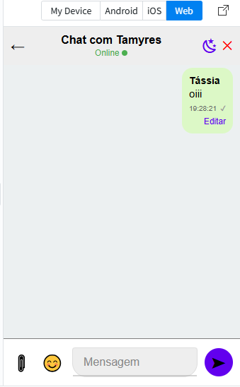
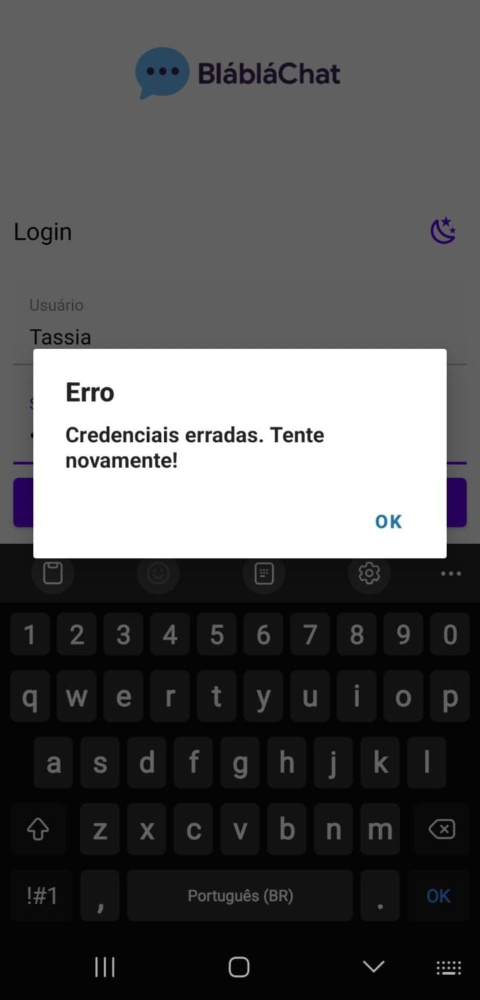
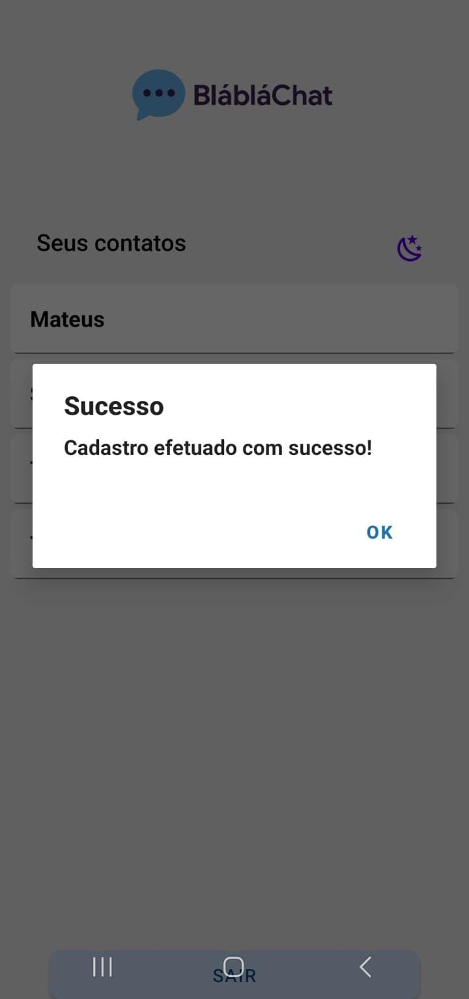

# 🚀 BlaBlaChat: Um Aplicativo de Mensagens Híbrido com React Native e Firebase


_Um aplicativo de mensagens moderno e interativo, desenvolvido para o trabalho final da disciplina de Laboratório de Desenvolvimento de Aplicativos Híbridos._

---

## 📚 Sumário

- [👥 Equipe de Desenvolvimento](#-equipe-de-desenvolvimento)
- [🎯 Objetivos Gerais do Projeto](#-objetivos-gerais-do-projeto)
- [🛠️ Base do Projeto e Tecnologias](#️-base-do-projeto-e-tecnologias)
- [✨ Funcionalidades Implementadas](#-funcionalidades-implementadas)
  - [Funcionalidades Obrigatórias](#funcionalidades-obrigatórias)
  - [🌟 Componente Criativo (Diferencial Obrigatório)](#-componente-criativo-diferencial-obrigatório)
- [📸 Galeria de Telas](#-galeria-de-telas)
- [🚀 Como Rodar o Projeto](#-como-rodar-o-projeto)
- [📂 Estrutura do Projeto](#-estrutura-do-projeto)

---

## 👥 Equipe de Desenvolvimento

| Nome Completo                     | Matrícula   |
|----------------------------------|-------------|
| Tássia Mª Mendonça do Nascimento | 202212166   |
| Mateus Barreto das Chagas        | 202212170   |
| Tamyres Lopes de Faria Silva     | 202211177   |

**Instituição:** Universidade de Vassouras - Campus Maricá  
**Matéria:** Laboratório de Desenvolvimento de Aplicativos Híbridos  
**Trabalho:** Evolução de Aplicativo de Mensagens com React Native e Firebase

---

## 🎯 Objetivos Gerais do Projeto

Durante o desenvolvimento do BlaBlaChat, focamos em atingir os seguintes objetivos, que foram integralmente cumpridos:

1. **Aprofundar Conhecimento Prático**
2. **Dominar Firebase Realtime Database**
3. **Exercitar Análise, Design e Implementação**
4. **Promover Trabalho em Equipe**
5. **Estimular Criatividade e Inovação**

---

## 🛠️ Base do Projeto e Tecnologias

* **Repositório Base:** [loyoladesa/AplicativosHibridos2025](https://github.com/loyoladesa/AplicativosHibridos2025/tree/whatsapp-firebase)
* **Frontend:** React Native + Expo
* **Backend:** Firebase Realtime Database
* **Outras libs:** react-native-paper, expo-image-picker, expo-document-picker, firebase

---

## ✨ Funcionalidades Implementadas

### Funcionalidades Obrigatórias

1. **Conversas Particulares**  
2. **Destaque Visual para Mensagens Próprias**  
3. **Envio de Arquivos (Imagens e Documentos)**  
4. **Confirmação de Visualização de Mensagem**  
5. **Exibição da Hora de Envio da Mensagem**  
6. **Criação e Integração de Logotipo**  
7. **Edição de Mensagem Enviada**  

### 🌟 Componente Criativo (Diferencial Obrigatório)

- **Reações a Mensagens com Emojis**
- **Temas Personalizáveis (Claro/Escuro)**
- **Status Online/Offline em Tempo Real**

---

## 📸 Galeria de Telas

### Tela de Login - Android - Modo Claro


### Tela de Chat - Modo Claro


### Tela de Chat - Modo Escuro


### Tela de Login com Credenciais Erradas


### Tela de Login de Cadastro com Sucesso


---

## 🚀 Como Rodar o Projeto

Este projeto foi desenvolvido e prototipado principalmente na plataforma **Expo Snack** (`https://snack.expo.dev/`), o que facilitou o desenvolvimento rápido e os testes iniciais. Para testar o BlaBlaChat em seu ambiente de desenvolvimento local, siga os passos abaixo:

1.  **Clone o Repositório:**
    ```bash
    git clone https://github.com/loyoladesa/AplicativosHibridos2025.git
    cd AplicativosHibridos2025/whatsapp-firebase
    ```
2.  **Instale as Dependências:**
    ```bash
    npm install # ou yarn install
    ```
3.  **Configurações do Firebase:**
    * Crie um projeto no [Firebase Console](https://console.firebase.google.com/).
    * Crie um **Realtime Database** para o projeto.
    * Vá para "Configurações do projeto" (ícone de engrenagem) > "Seus aplicativos" > "Adicionar aplicativo" (selecione a opção **Web** `</>`). Copie as credenciais de configuração.
    * Crie ou atualize o arquivo `config/Firebase.js` com suas credenciais:
        ```javascript
        import firebase from 'firebase/app';
        import 'firebase/database';

        const firebaseConfig = {
          apiKey: "SEU_API_KEY",
          authDomain: "SEU_AUTH_DOMAIN",
          databaseURL: "SEU_DATABASE_URL",
          projectId: "SEU_PROJECT_ID",
          storageBucket: "SEU_STORAGE_BUCKET",
          messagingSenderId: "SEU_MESSAGING_SENDER_ID",
          appId: "SEU_APP_ID"
        };

        // Inicializa o Firebase se ainda não foi inicializado
        if (!firebase.apps.length) {
          firebase.initializeApp(firebaseConfig);
        }

        export const database = firebase.database();
        ```
    * **Configure as Regras do Realtime Database (para desenvolvimento):**
        No Firebase Console, vá em "Realtime Database" > aba "Regras". Para facilitar o desenvolvimento, defina:
        ```json
        {
          "rules": {
            ".read": "true",
            ".write": "true"
          }
        }
        ```
        ⚠️ **ATENÇÃO:** Essas regras **não são seguras para produção**! Para um aplicativo real, implemente regras de segurança mais robustas e utilize o Firebase Authentication.
    * **Opcional: Estrutura Inicial do Banco (`banco.json`):** Para popular o banco com dados de exemplo (usuários, chats), você pode importar o conteúdo do `banco.json` fornecido para o seu Realtime Database (aba "Dados" > menu de três pontos > "Importar JSON").

4.  **Execute o Aplicativo:**
    ```bash
    npm start # ou expo start
    ```
    * Isso abrirá uma janela do navegador com o Expo Dev Tools.
    * **Recomendado:** Escaneie o QR Code com o aplicativo **Expo Go** no seu smartphone (Android/iOS) para uma experiência mais fiel e para testar a integração com o Firebase de forma mais confiável.
    * Você também pode optar por rodar em um simulador/emulador conectado.

---

## 📂 Estrutura do Projeto

```text
whatsapp-firebase/
├── assets/                  # Contém o logotipo da aplicação e outros recursos visuais (ícones, splash screens).
│   ├── blablachat.png       # Logotipo principal do app.
│   ├── icon.png
│   ├── splash-icon.png
│   └── screenshots/         # Capturas de tela do aplicativo para documentação.
│       ├── Screenshot_183.png
│       ├── Screenshot_184.png
│       └── Screenshot_185.png
├── components/              # Contém os principais componentes React que compõem as telas do aplicativo.
│   ├── ContactsScreen.js    # Tela para listar usuários e iniciar novas conversas.
│   ├── Login.js             # Tela de autenticação de usuários (login e cadastro).
│   └── Mensagens.js         # Tela principal de chat, onde as mensagens são exibidas e enviadas.
├── config/                  # Contém arquivos de configuração globais.
│   └── Firebase.js          # Configurações de inicialização do SDK do Firebase.
├── App.js                   # Componente raiz da aplicação, gerencia o estado global (navegação, temas) e renderiza as telas principais.
├── app.json                 # Arquivo de configuração do Expo para o aplicativo (nome, ícone, splash screen, etc.).
├── package.json             # Lista de dependências do projeto e scripts.
└── README.md                # Este arquivo de documentação.
